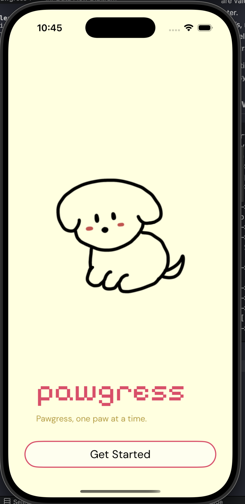
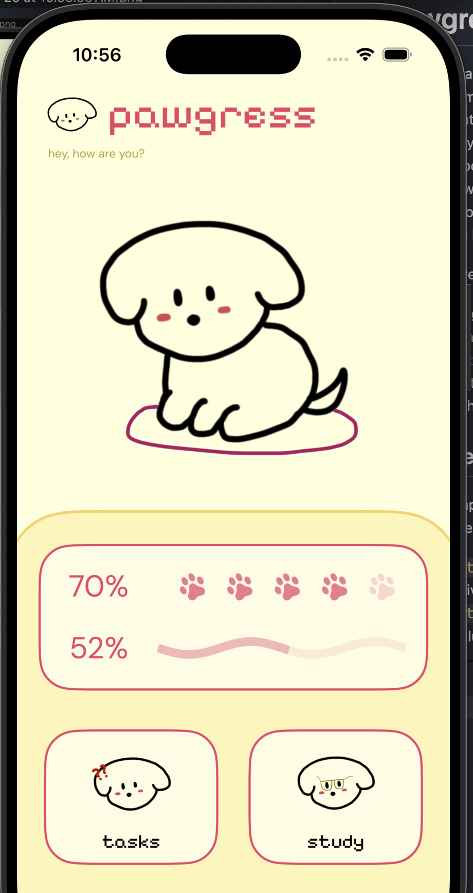
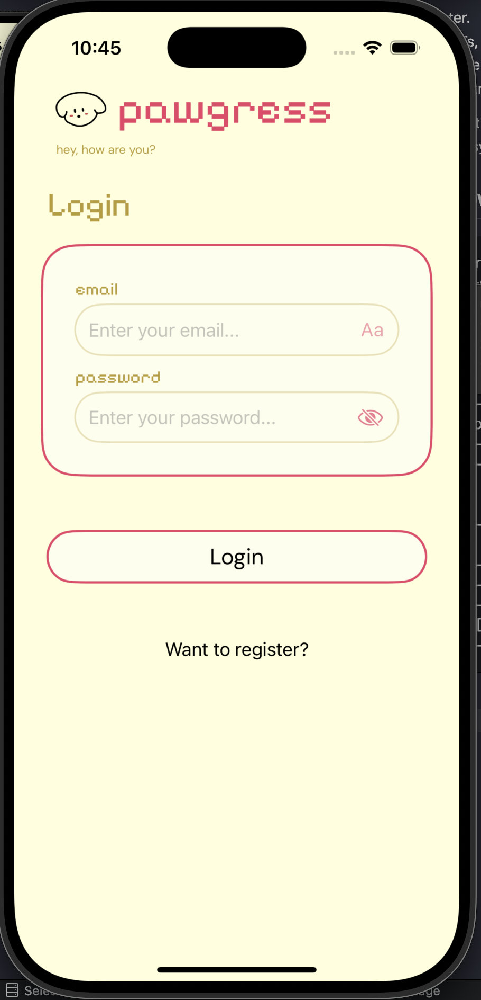
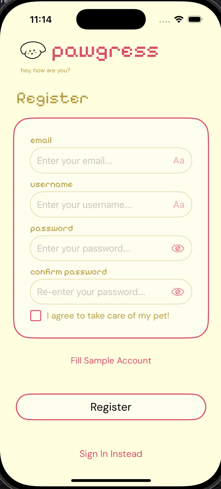
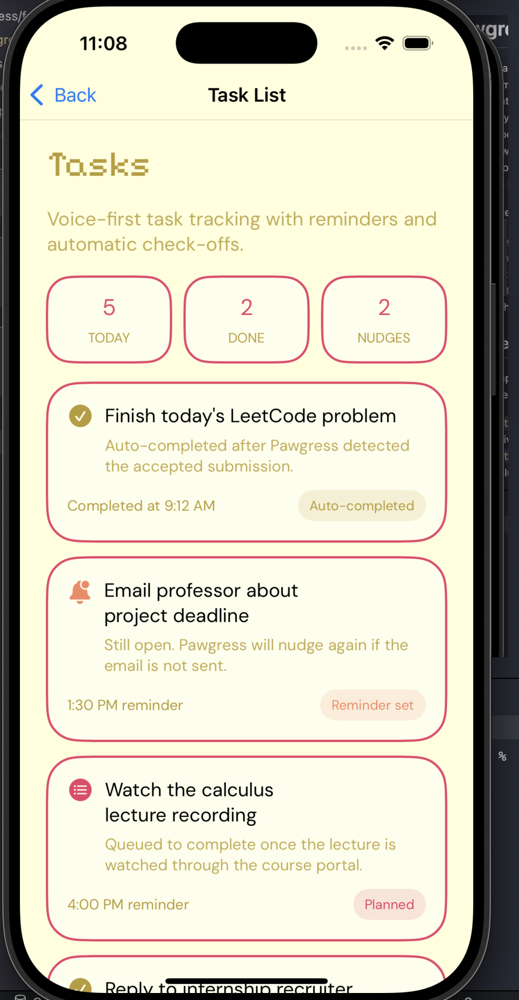
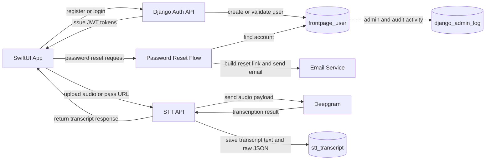

# Pawgress

Pawgress is a voice-first productivity app designed to make task management feel lighter, faster, and more motivating. Instead of relying on manual checklists, it uses spoken task capture, reminders, and **automatic** progress tracking for activities like LeetCode practice, emailing a professor, or watching a lecture.

What makes Pawgress different is that productivity is tied to caring for a virtual puppy. Completing tasks helps keep your pet healthy and cared for, turning productivity into a more engaging and emotional experience than a normal task manager.

## Homepages

### Login/Sign Up

### Tasks

## What Makes Pawgress Different

Pawgress is meant to be a low-friction productivity tool, especially for people with ADHD. The core idea is that the app should not force the user to keep reopening a task list just to manually clean it up. Instead, it can track the user's spoken updates, turn those updates into task progress, automatically tick off completed work, and send reminders when something is still pending.

That interaction model is what makes the product feel different:

- say the task out loud,
- let the system track it,
- get reminded when needed,
- and move on without the extra step of manually deleting or checking off every item.

The goal is to reduce the friction between intention and action. Instead of managing a task manager, the user can verbally capture the task and then just go do it.

There is also a built-in incentive layer: the user is taking care of a puppy. The productivity loop is not just about clearing a list, it is about keeping your pet healthy and happy. If you stay on top of your work, your puppy is cared for. If you ignore everything, your puppy can end up neglected or hungry. That makes the experience feel more like taking care of a pet than maintaining a normal task app.

## Why The Tables Matter

The most important design lesson in this project was that not every piece of data deserves its own table.

- `frontpage_user` exists because user accounts are long-lived and central to the app.
- `stt_transcript` exists because transcript results are valuable records that may need to be reviewed later.
- JWTs, request payloads, and temporary form state do not belong in the database because they are short-lived transport data.

That distinction was the moment where the project started feeling like system design instead of just feature building.

## Data Flow Diagram

### Current app tables

- `frontpage_user`
  - Stores the custom user model for registration, login, password changes, and profile access.
  - Main fields: `email`, `name`, `password`, `tc`, `is_active`, `is_admin`, timestamps.
- `stt_transcript`
  - Stores speech-to-text results returned by Deepgram.
  - Main fields: `request_id`, `text`, `raw`, `created_at`.

### How the tables are related

There is no direct foreign key between `frontpage_user` and `stt_transcript` yet. They are related through application flow, not through schema:

- A user authenticates through the backend.
- The client sends a transcription request.
- The backend sends audio to Deepgram.
- The backend saves the transcript result in `stt_transcript`.

That is still a valid design. It means the transcript table is acting like a system record of external STT work, not yet like per-user owned content. If I kept evolving this design, the next logical schema improvement would be adding `user_id` to `stt_transcript` so every saved transcript can be tied back to the account that created it.

## Data Flow

### Registration and login

1. The SwiftUI client sends credentials to the Django API.
2. Django validates the payload with serializers.
3. The custom `frontpage_user` record is created or authenticated.
4. SimpleJWT issues access and refresh tokens.
5. The frontend uses those tokens for authenticated API calls.

### Password reset

1. A user submits an email address.
2. Django finds the matching `frontpage_user`.
3. Django creates a reset token and UID pair.
4. The backend builds a reset URL from environment config and sends the email.

### Speech-to-text flow

1. The client uploads an audio file or passes an audio URL.
2. The Django `stt` app forwards the request to Deepgram.
3. Deepgram returns the transcription payload.
4. Django extracts the main transcript text.
5. Django writes a new row into `stt_transcript`.
6. The API response returns both the raw transcription and the saved transcript ID.

## Production Cleanup In This Version

This cleanup pass focused on turning the repo from a local prototype into something safer to ship:

- Removed hardcoded backend secrets and machine-specific Firebase credential paths from runtime config.
- Switched Django settings to environment-driven configuration.
- Added `AUTH_USER_MODEL` so the project uses the custom user model consistently.
- Made the Deepgram client lazy-loaded so the app can boot even if STT dependencies are missing.
- Replaced hardcoded frontend API URLs with an `APIBaseURL` config value in `Info.plist`.
- Stopped logging credentials and token-related debug output in the auth flow.
- Made password reset responses generic so the API does not reveal whether an email is registered.
- Locked the STT endpoint behind authenticated requests instead of leaving it publicly writable.
- Added `.gitignore` and `.env.example`.
- Prepared the repo to stop tracking generated or sensitive files like `.env`, `db.sqlite3`, `staticfiles`, `.DS_Store`, `__pycache__`, and Xcode user-state files.

## Running Locally

### Backend

1. Install dependencies from `pawgress/requirements.txt` in your preferred Python environment.
2. Copy `pawgress/.env.example` to `pawgress/.env` and fill in real values.
3. Run migrations.
4. Start the server with `python manage.py runserver`.

### Frontend

1. Open `pawgress-frontend` in Xcode.
2. Set the `API_BASE_URL` build setting to your backend URL.
3. Build and run the app.

## What This Project Taught Me

This project was the first time I really had to think about boundaries:

- what should be permanent data,
- what should stay transient,
- what belongs in a model,
- and how requests move across frontend, backend, third-party APIs, and storage.

That is the part of the project that made system design click for me.
